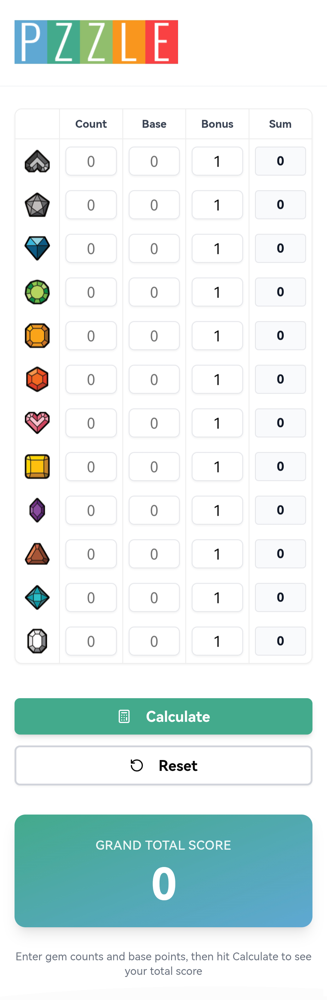

# [01] ジュエル・ポーカー (Jewel Poker)
**バージョン:** 1.2 | **プレイ人数:** 2–4人 (最大12人以上まで対応)

『ジュエル・ポーカー』の世界へようこそ。本作はセットコレクション、タクティカルなダイス操作、そしてパターン認識を組み合わせた戦略的なボードゲームです。

---

## ゲーム仕様 (Game Specifications)

| プレイヤー人数 | 推奨カード枚数 | 1人あたりの手札枚数 |
| :--- | :--- | :--- |
| **2人** | 30 - 40 枚 | 15 - 20枚以上 |
| **3 - 4人** | 45 - 80 枚 | 15 - 20枚以上 |

> **備考:** カード枚数を増やすことで、より深く、戦略的で時間のかかるゲームセッションを楽しむことができます。

---

## 内容物 (Game Components)
ゲームを始める前に、以下のコンポーネントが揃っているか確認してください：

* **メインスコアボード:** 1枚 – 各ジュエルのスコアスロットにダイスを配置し、得値を決定するために使用します（スターターAおよびスターターBに付属）。
* **PZZLEカード:** 1セット (30 - 80枚) – セットコレクションや手札でのスコアボーナスパターンを作成するためのジュエルシンボルカードです。
* **ジュエルダイス:** 12個 – スコアボード上での倍率（マルチプライヤー）と位置を示すための専用ダイスです。

---

## セットアップ (Setup Phase)
1. **初期手札:** 各プレイヤーに **PZZLEカードを5枚** ずつ配ります。
2. **中央ディスプレイ:** 場の中央に **5枚のカード** を表向きで並べます。
3. **山札 (Draw Pile):** 残りのカードを裏向きに重ねて山札を作ります。
4. **ジュエルダイス:** 全 **12個のジュエルダイス** を共通エリア（サプライ）に置きます。

---

## ゲームの進行 (Play Phase)
時計回りに手番を進めます。自分の手番では、以下の **6つのアクションから1つ** を選択して実行しなければなりません。

> [!IMPORTANT]
> **手札上限 (Hand Limit):** 手番終了時に、手札が **5枚** を超えてはいけません。

### 選択可能なアクション:
1. **手札の入れ替え (Cycle Hand):** 手札から1枚捨て、山札から新しく1枚引く。
2. **市場での交換 (Market Exchange):** 手札から1枚捨て、中央ディスプレイから好きなカードを1枚取り、山札からディスプレイに1枚補充する。
3. **ダイスの配置 (Deploy Jewel):** ジュエルダイスをスコアボードに配置する（最初は **数字のない面** を上にします）。その後、山札から1枚引き、内容を見ずに裏向きのまま捨て札にします。
4. **位置の入れ替え (Swap Positions):** すでにボード上にある **2つのダイス** の位置を入れ替えます。その後、山札から1枚引き、裏向きのまま捨て札にします。 *(下記の「入れ替えルール」に従います)*
5. **倍率の調整 (Adjust Multiplier):** ダイスの倍率面を **+1 または -1** 変更します。
    * *特殊ルール:* **「3」から直接「1」** に下げることも可能です。
    * 調整後、山札から1枚引き、裏向きのまま捨て札にします。

---

## ダイスの配置と入れ替えルール

### 1. 配置の固定
一度スコアボードに配置されたジュエルダイスは、ゲーム終了まで取り除くことはできません。

### 2. 全体クールダウン (Global Swapping Cooldown)
あるプレイヤーが **入れ替えアクション (Swap)** を実行した場合、他のプレイヤーは、その実行者の次の手番が回ってくるまで「入れ替えアクション」を選択できません。

### 3. 個人クールダウン
同一のプレイヤーが2ターン連続で **入れ替えアクション (Swap)** を実行することはできません。

### 4. スロットの許容量 (Slot Capacity)
ボード上の各スロットには、ドット（点）で示された収容上限があります：
* **スロット 11 (ドット1つ):** 最大 1個まで配置可能
* **スロット 7 (ドット2つ):** 最大 2個まで配置可能
* **スロット 0, 1, 2, 3:** 無制限に配置可能

### 5. 初回配置の制限
ゲーム中で最初に配置されるダイスは、**スロット 0** に置くことはできません。

---

## ゲームの終了と勝敗

**山札がなくなった時点** でゲームは即座に終了します。最も合計得点が高いプレイヤーが勝者となります。

### スコア計算

合計得点は、各ジュエル種別のスコアの総和です。

#### 1. 基本スコア
> **(スロットの値 × ダイスの倍率) × 手札にあるそのジュエルの枚数**

#### 2. パターンボーナス (倍率)
手札のカードでジュエルのパターン（同じシンボルの並び）を確認します（**横、または斜めのラインのみ** 有効です。垂直（縦）ラインは含まれません）。
* **3つ並び:** 得点 x2
* **4つ並び:** 得点 x5
* **5つ並び:** 得点 x10

---

## スコア計算アシスタントアプリ
計算を簡単にするために、この **QRコード** をスキャンしてデジタル計算機にアクセスしてください。

---

| 入力項目 | 説明 |
| :--- | :--- |
| **列1: 個数 (Quantity)** | 手札にある特定のジュエルシンボルの合計数。 |
| **列2: 値 (Value)** | ボード上のそのジュエルの現在値（例：スロット5で倍率2の場合 = **10**）。 |
| **列3: ボーナス (Bonus)** | 達成したパターンボーナス（2, 5, または 10）を入力。ボーナスがない場合は **1** のままにします。 |

---
**注意:** QRコードが読み取れない場合は、[https://linktr.ee/pzzletarot](https://linktr.ee/pzzletarot) にアクセスし、**「Jewel Poker Calculator」** を選択してください。
